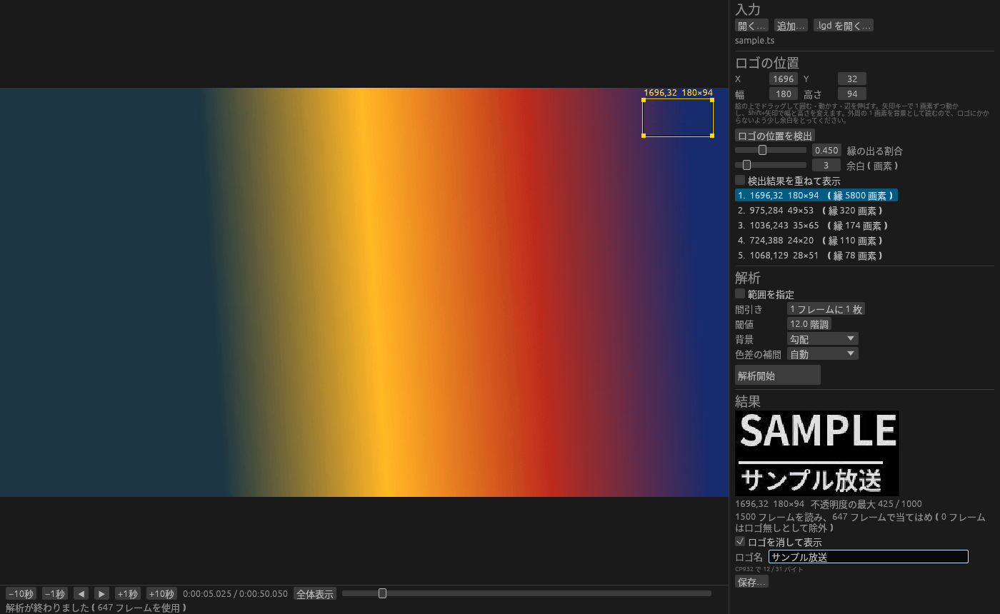

<div align="center">


# LogoScan

**AviUtl's logo analysis, without AviUtl.**

Build the `.lgd` that the transparent-logo filter removes, straight from a recording.

[](LICENSE)
[](src/)

English ・ [日本語](README.ja.md)



</div>

<sub>A test clip with a made-up logo, after finding and analysing it. The extracted opacity is at the bottom right; inside the yellow box the picture is shown with the logo removed.</sub>

LogoScan writes the same `.lgd` files as the logo analysis plugin for AviUtl (logoscan),
so the transparent-logo filter (delogo) and every other tool that reads `.lgd` can use them as they are.
It comes as a window (`lgdscan-gui`, labelled in Japanese) and as a command (`lgdscan`) that share the same engine.

Video is read through the `ffmpeg` and `ffprobe` commands.

## Download

From [Releases](https://github.com/DeepRegular/LogoScan/releases):

- **Windows** — `LogoScan-<version>-windows-x86_64.zip`. Unpack it anywhere and run `lgdscan-gui.exe`.
  FFmpeg comes with it, in the `ffmpeg` folder.
- **Linux** — `LogoScan-<version>-linux-x86_64.tar.gz`, for Ubuntu 22.04 or later and the like
  (glibc 2.35). Install FFmpeg from your distribution (`sudo apt install ffmpeg`).

`ffmpeg` and `ffprobe` are looked for next to the program, then in an `ffmpeg` folder beside it,
then on `PATH`.

## The window

```
lgdscan-gui recording.ts [logo.lgd]
```

Recordings can also be dropped on the window (hold Shift to add to the inputs instead of replacing them).

1. **Find the logo.** 120 keyframes spread over the recording are read and the box is placed on the most
   logo-like spot. Other candidates are listed; moving *edge share* or *margin* recomputes them on the spot.
2. **Adjust the box on the picture.**
   - Drag outside the box to draw a new one, inside to move it, on an edge or corner to resize it.
   - Arrow keys move it by one pixel; Shift+arrows change its width and height.
   - The wheel zooms, a right or middle drag pans, a right double-click or *Fit* shows the whole picture.
     Past 2× the pixels are shown as they are.
3. **Analyse.** When it finishes, the logo appears on a checkerboard — in its own colours, as translucent as
   it is — and the picture switches to the logo removed. Move the slider to see how it holds up on other scenes.
4. Name the logo. **ロゴの出る区間とフェードを測る** (Measure where the logo shows and how it fades) reads the
   recording again (see "Where the logo is on screen" below); the call in the results takes the measured fades
   (`fadein`, `fadeout`). Skip it if you do not need the fades.
5. **Save**. The sample .avs takes the measured fades too.
6. **この録画用の .avs を保存…** (Save an .avs for this recording) writes that recording's own script, one call
   per stretch measured, if you want one.

For a moving logo, switch *Analyse* to **Moving logo** (see "A logo that moves" below). Open many recordings
(*Add…*, or drop with Shift held), box the area the animation passes through and press **Analyse**. The result
has a slider through the frames of the animation; pick a recording from the list of start frames to see that
frame of it with the logo removed. **Save (.ldp)…** writes all the frames, **Save the still logo (.lgd)…** the
logo it settles into. Opening an .ldp shows its frames.

## The command

```
lgdscan scan recording.ts --rect 1700,34,157,45 -o logo.lgd -n MyLogo
```

`--rect` is X,Y,width,height. Leave a little space around the logo: the outermost one-pixel ring of the box
is read as background, so the logo must not touch it. Any number of inputs may be given; more of them give
the background a wider range of colours and a steadier result.

| Option | Default | |
|---|---|---|
| `--start` / `--end` | whole input | range to read, in seconds |
| `--step N` | 1 | read one frame in N |
| `--threshold T` | 12 | how far ring pixels may stray from the background model, in 8-bit levels |
| `--background plane\|flat` | plane | `plane` fits a gradient to the ring; `flat` takes its mean, as logoscan does |
| `--scan auto\|progressive\|interlaced` | auto | how 4:2:0 chroma is interpolated vertically |
| `--max-frames N` | 8000 | frames kept for the fit; beyond that a random subset |
| `--passes N` | 3 | least-squares passes; outliers are dropped from the second on |

To find the logo only:

```
lgdscan detect recording.ts
```

prints candidates as `--rect X,Y,W,H`, most likely first. `--share` (edge share, 0.45), `--margin` (3)
and `--samples` (keyframes, 120) can be changed.

Where a logo is on screen in a recording:

```
lgdscan spans logo.lgd recording.ts
```

prints each stretch's frames and fades, and the chained `EraseLOGO` calls. `--start` / `--end` narrow what is
read (frames still count from the recording's first); `--pictures` counts pictures rather than time (see
"Where the logo is on screen"); `--depths FILE` also writes the share of the logo measured in each frame.

Also:

- `lgdscan info logo.lgd` prints the header
- `lgdscan compare A.lgd B.lgd` compares two logos pixel by pixel
- `lgdscan render logo.lgd out.pgm` writes the luma opacity as a greyscale picture
- `lgdscan erase logo.lgd recording.ts SECONDS out.ppm` shows that frame before and after removal, side by side

## How it works

A logo sits on the picture as `observed = background × (1 − α) + logo × α`.
From the frames whose background is known, LogoScan fits `observed = A × background + B` for every pixel
and every one of Y, Cb and Cr, and stores `dp = (1 − A) × 1000` and `colour = B / (1 − A)` — the same
formulas and the same rounding as logoscan.

Three things differ from logoscan:

- **Background.** A ring that is a smooth gradient is accepted, not just a flat one. Flat frames alone are
  almost all white or black: on white the logo cannot be seen, and on black (scene changes) it is usually
  not shown at all, so neither tells anything.
- **Frames without the logo are set aside.** After a first fit, each frame is checked on the pixels where
  the logo is strongest: if "no logo" explains it better than the fitted blend, it is dropped and the fit
  is run again. Commercials and fades in the range do no harm, so the range need not be picked by hand.
- **Chroma is shaped as AviUtl sees it.** Horizontally the samples sit on the even pixels and the odd ones
  take the mean of their neighbours; vertically, interlaced 4:2:0 is interpolated within each field at
  MPEG-2 positions. Without this, the chroma opacity does not match AviUtl's.

## A logo that moves

Some channels bring their logo in with an animation at the start of a programme and then leave it standing.
The animation plays the same way every time, so one logo per frame of it removes it.

```
lgdscan anim rec1.ts rec2.ts rec3.ts … --rect 0,0,704,320 -o anim.ldp --still settled.lgd
```

How to use it:

1. Gather many recordings from the same channel; one alone cannot be analysed. About thirty give a steady
   result (with a dozen or so the last frames cannot be worked out well, and a warning says so).
2. Cut each recording from a little before the logo animation starts to after the logo has gone from the
   picture (ten seconds or so).
3. Give the area the logo moves about in with `--rect`, all of it inside (in the window, draw the box).

- `--rect` is the area the whole animation plays in. Memory grows with it: 704×320 over 72 recordings takes
  about 1.3 GB and three minutes or so.
- The file is written in the .lgd format with one logo per frame, named `0`, `1`, `2`… in order. Each frame's
  box is cut down to its own logo. The last one is the first frame on which the logo stands still.
- `--still` also writes that still logo to a .lgd of its own.
- The animation need not start at the same point in every recording: shifts of up to `--search` frames
  (90) are found, and the frame each recording starts on is printed.
- The same inputs give the same file, byte for byte.
- Opacity stops at 999: delogo turns the picture inside out on a pixel over 1000.

The .ldp is ready for delogomod in AviSynth. `EraseLogomod` applies the logos in the file one per frame, top
to bottom, and keeps applying the last once they run out; as with the other .ldp, what follows once the logo
stands still is left to `end` and `fadeout`. `start` is the start frame lgdscan prints for that recording, and
`end` and `fadeout` are measured from the recordings, printed, and written into the sample script (below):

```
EraseLogomod(logofile="anim.ldp", start=3, end=3+232, fadeout=22)
```

For every frame after the logo settles, the depth at which removing the still logo leaves its edges flattest
is found; delogomod's fade (a straight ramp down over the last `fadeout` frames before `end`) is fitted to the
middle value over all recordings. On the 72 recordings here the depth stays at 0.99 up to frame 209 and falls to
nothing at 234. The example that comes with delogomod (`end=start+218, fadeout=28`) would start fading these
while the logo is still at full strength. Recordings that stop before the logo is gone give no `end` and
`fadeout` (a warning says so). lgdscan counts frames from the first one it decodes; depending on how AviSynth opens the
file, the count may start a frame or two apart, so check the result.

### Sample scripts

Each logo file gets a sample of how to use it, an .avs of the same name (CP932, CRLF line ends). `lgdscan anim`
always writes one beside the .ldp and `lgdscan spans` beside the .lgd; the window writes one on saving while
*also write a sample .avs* is ticked, and again when **ロゴの出る区間とフェードを測る** (Measure where the logo shows and how it fades) finishes after the save;
`lgdscan avs logo.ldp --end 232 --fadeout 22` or `lgdscan avs logo.lgd --fadein 21 --fadeout 28` writes one afterwards.

For an .ldp it is a plain call of delogomod's `EraseLogomod`, with the measured `end` and `fadeout`:

```
#EraseLogomod(logofile="anim.ldp", start=16, end=16+232, fadeout=22)
#EraseLogomod(logofile="anim.ldp", start=0, end=232-20, fadeout=22, logo_start=20)
```

For an .lgd it is delogo's `EraseLOGO`, one call per stretch of the programme, with the measured `fadein` and
`fadeout` once the fades have been measured (none for a station whose logo does not fade); the frame numbers stay
examples:

```
#EraseLOGO(logofile="logo.lgd", start=300, end=15299, fadein=21, fadeout=28, interlaced=true).EraseLOGO(logofile="logo.lgd", start=18000, end=32399, fadein=21, fadeout=28, interlaced=true)
```

The frame numbers are examples. Opening the recording and `LoadPlugin` are left to your own script.

The window's results also show a call ready to use, with **コピー** (Copy) to put it on the clipboard: for a moving logo,
at the chosen recording's start frame with the measured `end` and `fadeout`; for a station logo, over the analysed
range (the whole recording when none is set), with `interlaced` from the scan type. Once **ロゴの出る区間とフェードを測る**
(Measure where the logo shows and how it fades) has been pressed, the line also carries the measured fades. The
recording's own script, one call per stretch, is written only by **この録画用の .avs を保存…** (Save an .avs for
this recording).

## Where the logo is on screen

`EraseLOGO` run where there is no logo prints the logo's shape into the picture, so it has to be called per
stretch, leaving out the commercials. Some stations also fade their logo in after a break and out before one;
there `fadein` and `fadeout` have to match too, or the logo lingers as it comes and goes. `lgdscan spans`
(**ロゴの出る区間とフェードを測る** in the window) measures all four.

1. Each frame is measured for the share of the logo whose removal leaves the least step across the edges the
   logo draws. The edges are taken in chroma as well as luma: a logo drawn in colours on an evenly translucent
   plate has the same opacity everywhere, and its lettering shows only in colour.
2. Where the logo would not show even if it were there — a white logo on white — the frame is left
   undecided and the state before it carries on, so a white scene does not cut the programme in two.
3. A second's median above half the logo is "on screen". Gaps under 5 seconds are closed, stretches under 3
   seconds dropped.
4. delogo's fade (from `start`, rising over `fadein` frames; falling over the `fadeout` frames up to `end`) is
   fitted at each end. The fade lengths are shared by all the ends in the recording, as a station fades the
   same way each time: fitted one end at a time, a scene as bright as the logo could stretch a fade badly.

On five 30-minute recordings of a station that fades its logo, the fades came out at 27 to 30 frames (about a
second), and the ends lie within a few frames of where the logo is seen to start and finish. For a station that
does not fade, no `fadein` or `fadeout` is written.

Frames are counted by the clock from the first picture that decodes at the start of the recording, so reading
a range gives the same numbers. Broadcast recordings can carry pictures that repeat a field and show for a frame
and a half; if your source filter counts pictures instead, the numbers drift apart further in, and
`lgdscan spans --pictures` counts the same way (the window has no switch for it yet).

## Finding the logo

The pictures change; the logo does not. Keyframes are sampled across the recording and, for every pixel,
the share of frames with an edge there is counted. Pixels with an edge in most frames are grouped — the gaps
between letters closed — into candidates. A logo that disappears during commercials only gets a lower share.
Pixels close to the border of the picture, and groups longer than half of it (letterbox lines and the like),
are left out.

## Logo names

Names are written in CP932 (Windows-31J), as AviUtl does. Characters that are easy to type on Linux or macOS
but missing from CP932 — 〜 (U+301C), ‖, —, ¢, £, ¬ — are replaced with their CP932 lookalikes
(～ ∥ ― ￠ ￡ ￢). Anything still impossible (é, emoji) is reported before saving.
A name holds 31 bytes; a longer one is cut without splitting a character. Files are always written as ver0.1.
Names are read as CP932 (or as UTF-8, when the bytes are valid UTF-8).

## Accuracy

A whole broadcast recording (MPEG-2 1080i, 30 minutes, a translucent white logo), compared with the `.lgd`
AviUtl made of the same logo:

| | Opacity correlation | Mean difference (/1000) |
|---|---|---|
| Y | 0.9996 | 2.1 |
| Cb | 0.9944 | 5.9 |
| Cr | 0.9929 | 6.4 |

Two logos made from different episodes of the same programme differ by about as much (chroma correlation
0.994); what remains depends on which frames went in.

## Not yet

- The fade fields of the .lgd header (fi/fo/st/ed) are left at 0; the fades go into the `EraseLOGO` calls
  instead (see "Where the logo is on screen").
- `scan` writes one logo per file.

## Building

```
cargo build --release
```

This builds `lgdscan` (the command) and `lgdscan-gui` (the window, made with eframe/egui).
For Japanese text the window uses a system font: Noto Sans CJK, IPA Gothic, Yu Gothic, Meiryo and so on.

## License

[GPL-3.0](LICENSE).

The Windows package includes an FFmpeg build from [BtbN/FFmpeg-Builds](https://github.com/BtbN/FFmpeg-Builds)
(GPL; its licence is in `ffmpeg/LICENSE.txt`, and the sources are at [ffmpeg.org](https://ffmpeg.org/download.html)).
